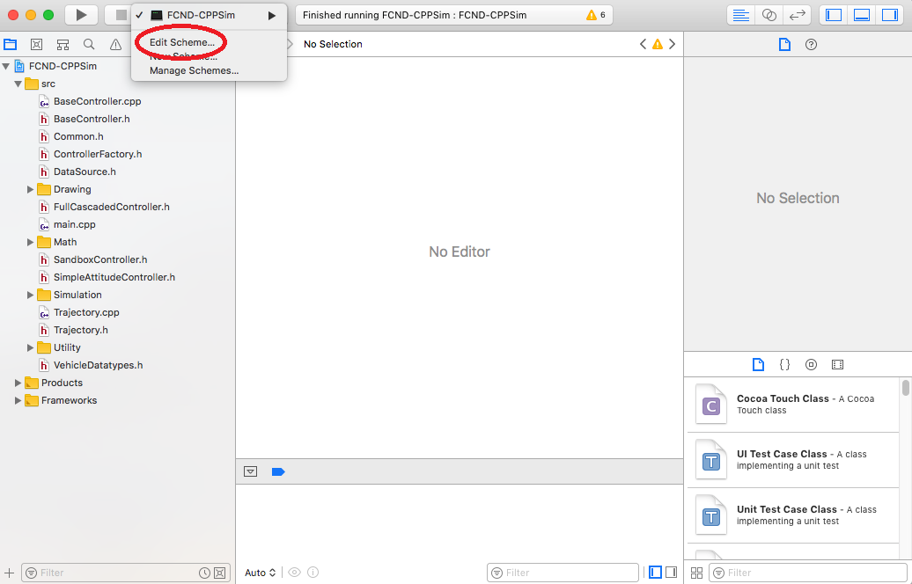
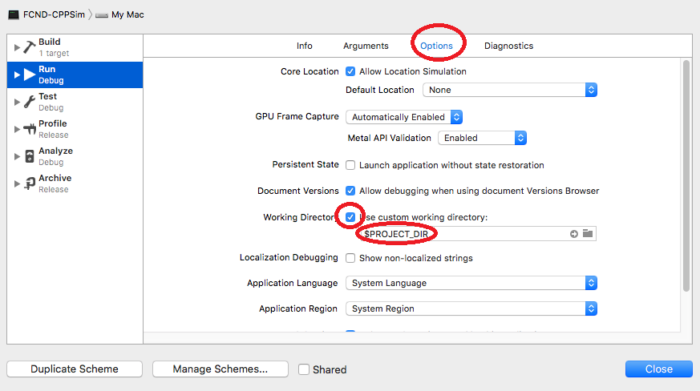

# AAE_003_3DQuadControl
Project 003 of Udacity's Autonomous Aerial Engineer ("Flying Car") Nanodegree, "3D Quadrotor Control"


## To complete this project on your local machine, follow these instructions:

Regardless of your development platform, the first step is to download or clone the [C++ Simulator Repository](https://github.com/udacity/FCND-Controls-CPP): ```git clone https://github.com/udacity/FCND-Controls-CPP.git```

Once you have the code for the simulator, you will need to install the necessary compiler and IDE necessary for running the simulator.

Below you can find the setup and install instructions for each of the recommended IDEs for each different OS options.

Once you have successfully installed the recommended IDE for your OS and have the simulator running, we can move on to taking a look around at the simulator and the files provided.


### Windows
For Windows, the recommended IDE is Visual Studio. Here are the steps required for getting the project up and running using Visual Studio.
  1. Download and install [Visual Studio](https://visualstudio.microsoft.com/vs/community/).
  2. Select Open Project / Solution and open ```<simulator>/Simulator.sln```.
  3. From the *Project* menu, select the *Retarget solution* option and select the Windows SDK that is installed on your computer (this should have been installed when installing Visual Studio or upon opening of the project).
  4. To compile and run the project / simulator, simply click on the green play button at the top of the screen. When you run the simulator, you should see a single quadcopter, falling down.
  
  
### Mac OS X
For Mac OS X, the recommended IDE is XCode, which you can get via the App Store.
  1. Download and install XCode from the App Store if you don't already have it installed.
  2. Open the project from the ```<simulator>/project``` directory.
  3. After opening project, you need to set the working directory:
  
  Go to *(Project Name)* | *Edit Scheme*
  
  
In new window, under *Run/Debug* on left side, under the *Options* tab, set Working Directory to ```$PROJECT_DIR``` and check *‘use custom working directory’*.
 

Finally, compile and run the project. You should see a single quadcopter, falling down.


### Linux
For Linux, the recommended IDE is QtCreator.
  1. Download and install QtCreator.
  2. Open the ```.pro``` file from the ```<simulator>/project``` directory.
  3. Compile and run the project (using the tab ```Build``` select the ```qmake``` option. You should see a single quadcopter, falling down.
  
**NOTE:** You may need to install the GLUT libs using ```sudo apt-get install freeglut3-dev```
